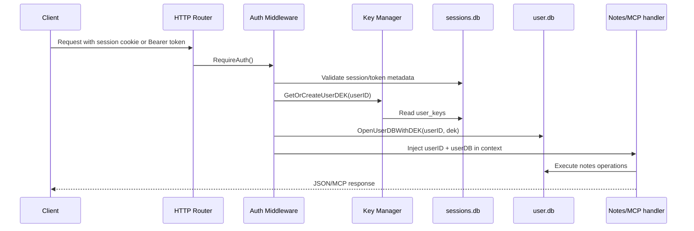

# common.ink ARCHITECTURE

## High-Level Topology
```mermaid
flowchart LR
    U[Web User] --> S[Go HTTP Server\ncmd/server/main.go]
    A[AI Client\nChatGPT/Claude/Other MCP] --> S

    S --> AM[Auth Middleware\ninternal/auth/middleware.go]
    AM --> NS[Notes Service\ninternal/notes]
    AM --> OAS[OAuth Provider\ninternal/oauth]
    AM --> M[MCP Server\ninternal/mcp]
    S --> WH[Web Handlers\ninternal/web]

    NS --> UDB[(Per-user SQLCipher DB\n{user_id}.db)]
    AM --> KM[Key Manager\ninternal/crypto/keymanager.go]
    KM --> SDB[(Shared sessions.db)]
    OAS --> SDB
    WH --> S3[(Tigris/S3 public objects)]
    WH --> SU[Short URL service\ninternal/shorturl]
    SU --> SDB
```

## Storage Architecture
```mermaid
flowchart TB
    MK[MASTER_KEY env secret] --> HKDF[HKDF-SHA256 Derivation\nKEK per user/version]
    HKDF --> WRAP[AES-256-GCM wrap/unwrap DEK]
    WRAP --> UK[(sessions.db.user_keys\nencrypted_dek + kek_version)]

    UK --> DEK[User DEK]
    DEK --> SQLC[SQLCipher key pragma]
    SQLC --> UDB[(data/{user_id}.db)]

    SDB[(data/sessions.db)] --> SESS[sessions]
    SDB --> OAUTH[oauth_clients/oauth_tokens/oauth_codes/oauth_consents]
    SDB --> MAGIC[magic_tokens]
    SDB --> SHORT[short_urls]
```

## Request Path (Authenticated API/MCP)


## Major Runtime Components
- Bootstrap and route wiring: `cmd/server/main.go`
- Configuration loading: `internal/config/config.go`
- Session/API-key/OAuth bearer auth: `internal/auth`
- OAuth authorization server and metadata: `internal/oauth`
- MCP tool surface and transport: `internal/mcp`
- Notes business logic (CRUD/search/storage): `internal/notes`
- Persistence and SQLCipher connection management: `internal/db`
- Web UX and static markdown pages: `internal/web`
- Object storage for published notes: `internal/s3client`
- Public short-link indirection: `internal/shorturl`
- Per-user request shaping and throttling: `internal/ratelimit`

## Operational Notes
- App uses a single process with `net/http` ServeMux.
- Per-user DB handles are cached in-process.
- `sessions.db` is shared and currently unencrypted.
- Rate limiting is per-user in memory (free/paid tiers configured, paid detection currently stubbed).
- MCP is mounted in stateless POST mode at top-level router (`GET`/`DELETE` intentionally `405`).
